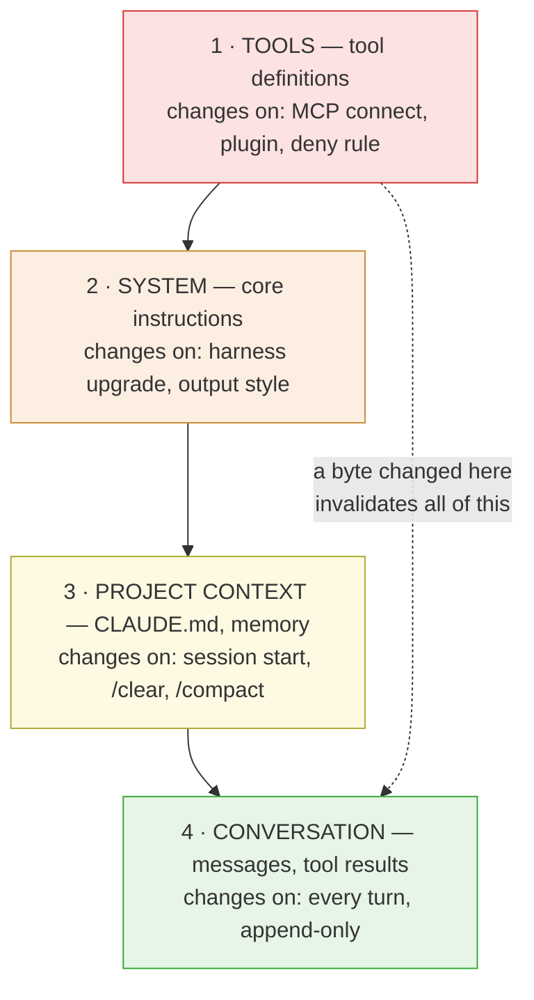

# Harness Economics

**What agentic coding actually costs, and which architecture decisions drive it.** A
subsystem-by-subsystem teardown of **Claude Code** and **GitHub Copilot**, with every claim
evidence-graded and a measurement harness you can run yourself.

**Compiled:** 2026-09-10 · ~21,400 words across 6 tracks · 137 inline citations · CC0

> [!WARNING]
> **No Copilot seat was available on the research machine, so every Copilot claim here is
> documentation-derived rather than observed.** Claude Code claims include direct verification against a
> local binary. This is the largest limitation of the current edition — stated here rather than buried.
> Details and the path to closing it: [`GAPS.md` §3](GAPS.md).

---

## The one idea everything else follows from

A model remembers nothing between turns, so a harness re-sends the entire conversation on every
request. Your bill is set by **what fraction of that payload can be served from cache** — and caching
is a prefix match on exact bytes, so a change anywhere invalidates everything after it.



Volatility increases downward; blast radius decreases. **The cheapest place for changing content is the
bottom, the most expensive is the top.** Both vendors reorganised their request architecture around
that single fact — which is why this is a caching teardown rather than a feature comparison.

## Start here

| If you want… | Go to |
|---|---|
| The short answer on **which is cheaper** | [`SYNTHESIS.md` §2](SYNTHESIS.md) |
| To look up **a setting** | [`reference/SETTINGS.md`](reference/SETTINGS.md) |
| To check **a known bug or its workaround** | [`reference/KNOWN-ISSUES.md`](reference/KNOWN-ISSUES.md) |
| **When a feature shipped**, with a link | [`TIMELINE.md`](TIMELINE.md) |
| The **full argument**, subsystem by subsystem | [the six tracks](#the-six-tracks) |
| To **run the measurements** | [Measure it yourself](#measure-it-yourself) |
| What we **could not determine** | [`GAPS.md`](GAPS.md) |

> [!NOTE]
> **"So which one is cheaper?"** — [`SYNTHESIS.md` §2](SYNTHESIS.md) answers it head-on. Short version:
> **not yet answerable.** No measurements have been taken, and the biggest cost driver — the vendor
> system prompt — is closed on Copilot's side. Exactly one directional claim survives the evidence, and
> it is narrow. That section also lists what cuts the *other* way, because a comparison that only finds
> fault with one side is advocacy.

## Five findings

The full set of ten is in [`SYNTHESIS.md` §1](SYNTHESIS.md).

| Finding | Why it matters |
|---|---|
| **Cache hit rate is the only cost lever that matters at scale** | At ten turns over one prefix, a cached session costs **~21%** of an uncached one. Model and effort choice are rounding errors next to it |
| **Both vendors price caching almost identically** | Reads ~10% of input, writes at a premium, on both. They differ in **control and visibility**, not price |
| **"Copilot has no telemetry" is false** | Both ship OpenTelemetry. Copilot's *tracing* is arguably better designed — GenAI semconv, clean spans, subagent propagation |
| **Only Claude Code tells you *why* the cache missed** | `likely cause: tool definitions changed`. The difference between a number and an action |
| **Claude Code's cache is per-machine *and per-directory*** | Two worktrees of the same repo never share one. Most users do not know this |

## Where they actually differ

Neither product wins outright: **Claude Code leads 5 of 8 capabilities, Copilot 3** — and they lead on
different *kinds* of thing, which matters more than the tally.

### Observability — a split decision

| Capability | Claude Code | Copilot |
|---|---|---|
| Tells you **why** the cache missed | ✅ | ❌ |
| Cost metric denominated in **USD** | ✅ | ❌ credits, computed downstream |
| Per-user **and** per-token attribution joinable | ✅ same data point | ❌ two systems, no common key |
| OTel **GenAI semantic conventions** | ❌ bespoke namespace | ✅ |
| Trace hierarchy + subagent propagation | ⚠️ beta | ✅ |

**Claude Code owns cost instrumentation; Copilot owns standards-compliant tracing.** Standardising
dashboards across many tools? Copilot's shape fits better. Working out why a bill is high? Only Claude
Code will tell you.

### Cache control — Claude Code, with one exception

| Capability | Claude Code | Copilot |
|---|---|---|
| User-facing TTL control | ✅ per request bucket | ❌ one undocumented keep-alive setting |
| Invalidation semantics documented | ✅ exhaustively | ❌ |
| **Cache-aware model routing** | ❌ | ✅ |

That last row is the idea in this teardown most worth copying: Copilot re-routes models **only at
boundaries where the prefix resets anyway** — turn one, and after compaction. Claude Code merely warns
you and lets you absorb the miss.

### The numbers — not a scoreboard

Values, not wins. Forcing these into ✅/❌ is what made the original single table unreadable.

| | Claude Code | Copilot |
|---|---|---|
| Cache read / write pricing | ~0.1× / 1.25×–2.0× | ~0.1× / +25% (free on older OpenAI models) |
| Max cache retention | **1 hour**, documented | 5m on the Anthropic path; a 24h OpenAI claim rests on [one blog sentence](TIMELINE.md) |
| Providers abstracted | 1 family | **6** |

That last row excuses much of the rest. **Copilot solved a harder problem** — two incompatible caching
paradigms behind one interface — and paid for it in the controls it can expose.

The full argument for every row is in [the six tracks](#the-six-tracks).

## The six tracks

| # | Document | Covers |
|---|---|---|
| 01 | [Request lifecycle](docs/01-request-lifecycle.md) | How each harness assembles a request; why position 0 is expensive |
| 02 | [Prompt caching](docs/02-prompt-caching.md) | Prefix matching, breakpoints, TTL, the invalidation catalogue, cache scope |
| 03 | [Context management](docs/03-context-management.md) | Compaction cost, memory loading, `/rewind` vs `/compact`, image eviction |
| 04 | [Tool and MCP loading](docs/04-tool-and-mcp-loading.md) | Deferred loading, tool search, the silent MCP reconnect problem |
| 05 | [Telemetry](docs/05-telemetry.md) | OTel on both sides, miss-cause attribution, the chargeback join problem |
| 06 | [Billing and cost anatomy](docs/06-billing-cost-anatomy.md) | Premium requests → AI credits, break-even math, structural incomparabilities |

## How claims are graded

Every capability is anchored to a dated shipping artifact, not a docs page asserting "requires vX".

| Grade | Means | Example |
|:--:|---|---|
| **A** | Vendor changelog entry or release note | `promptCacheTtl` in Claude Code v2.1.243 |
| **B** | Merged PR, **never got a release note** | `longToolCallCachePreservation`, VS Code 1.123 |
| **C** | Maintainer comment, no linked commit | `copilot-sdk#1073`'s fix — closed, unauditable |
| **D** | Vendor blog only, no shipping artifact | `prompt_cache_retention: "24h"` |
| **E** | User report, unreproduced | vscode#321551's cost multipliers |

> [!IMPORTANT]
> Applying that scale honestly **downgraded two of this repo's own claims**, including a headline
> finding. The retractions are documented in [`GAPS.md` §7b](GAPS.md) rather than quietly edited out — a
> teardown that never visibly corrects itself is not being checked.

## Measure it yourself

Every cost claim that is not a citation is reproducible:

```sh
just doctor          # environment preflight — reports what is and isn't available
just fixture         # generate the deterministic workload, print its hash
just measure-cache   # cold and warm cache-hit-rate and token mix
just measure-mcp     # what attaching an MCP server actually costs, A/B interleaved
just record FILE     # validate, leak-check, and promote a run into measurements/
```

The workload is a **generated** synthetic codebase pinned by hash — hermetic, no network,
byte-identical on any machine. Tasks are read-only and **verified against an expected answer**, because
an agent that gives up early produces a flatteringly low cost number and an unverified harness would
average that in silently.

> [!CAUTION]
> Two things to know before trusting any number the harness prints. Runs use `--bare`, which forces an
> API key — so reported cost is **API list price, not a subscription bill**. And the fixture is
> synthetic, so cross-run comparisons are valid while absolute figures are **not** a prediction for your
> codebase. Both expanded in [`METHODOLOGY.md` §3](METHODOLOGY.md).

The Copilot arm is [**documented-manual**](measure/copilot/SETUP.md), not an automated recipe — it needs
a paid seat and GUI configuration, and automating it would promise a reproducibility this environment
cannot honour.

## Conventions

| Rule | |
|---|---|
| **Sources are mandatory** | Every capability claim carries a URL and a fetch date |
| **Measured or cited, never asserted** | A number is backed by a citation or a file in `measurements/` |
| **Vendor claims are labelled as such** | Where a figure comes from a vendor blog and was not reproduced, the text says so at the point of use |
| **Negative findings are results** | "This cannot be measured, and here is why" belongs in `GAPS.md`, not in a silence |
| **Prices drift faster than research** | Both products ship weekly. Treat any uncited number as suspect and re-fetch |
| **No personal paths or credentials** | Enforced mechanically by `just leaks` |

```sh
just          # run all checks
just check    # leaks + links + sources + measurements + lint + fmt-check
just lint     # shellcheck every shell script
just fmt      # shfmt every shell script in place
just stats    # word and citation counts per document
```

> [!NOTE]
> These gates run locally via Lefthook, **not** in CI. A pull request from a fork will not run them —
> run `just check` before opening one, and expect a maintainer to run it on your branch.

Local hooks via [Lefthook](https://lefthook.dev); commits follow
[Conventional Commits](https://www.conventionalcommits.org). See [`CONTRIBUTING.md`](CONTRIBUTING.md).

Licensed [CC0 1.0](LICENSE) — public domain. **Corrections and reproductions are welcome**, especially
from anyone with a Copilot seat who can convert [`GAPS.md` §3](GAPS.md) from documented to observed.
