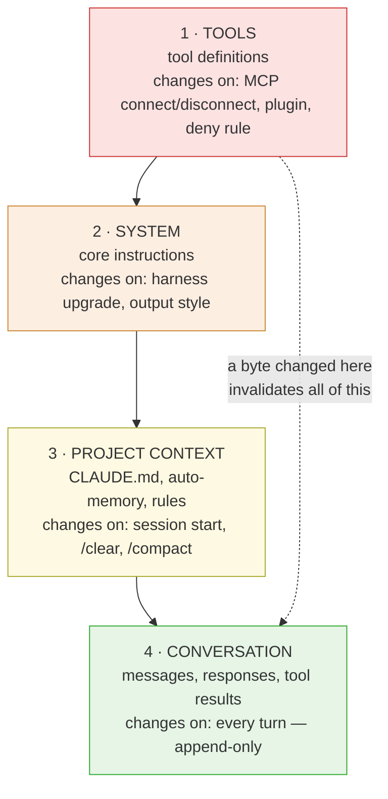

# 01 — Request lifecycle

**Research date:** 2026-09-10. **Scope:** how each harness assembles the HTTP request that goes to a
model provider on every turn, and which structural decisions in that assembly determine cost.

**Sourcing caveat that applies to this entire document:** Claude Code's request structure is
documented by Anthropic in public. GitHub Copilot's is not — its system prompt and tool schemas are
closed. Everything asserted about Copilot's request composition comes from GitHub's and Microsoft's
own engineering posts describing what they do, not from observing a request. Where the distinction
matters, it is flagged inline.

---

## 0. TL;DR

1. Both harnesses are **stateless clients**. The model remembers nothing between turns, so the entire
   conversation is re-sent on every request. The bill is therefore driven by what fraction of that
   re-sent payload can be served from cache, not by how much is new.
2. Claude Code targets **one provider family**. It can hard-code a caching strategy against Anthropic's
   explicit `cache_control` breakpoints and design the whole request shape around them.
3. Copilot targets **six providers** with two incompatible caching paradigms — explicit breakpoints
   (Anthropic) and automatic prefix inference (OpenAI). Its request layer is an abstraction over that
   difference, which is a materially harder engineering problem and produces different tradeoffs.
4. The single most consequential decision in both is **ordering by rate of change**: content that
   rarely changes goes first, volatile content goes last. Everything in track 02 follows from this.
5. Claude Code's system prompt embeds machine-local facts (working directory, platform, shell, OS
   version), which scopes its cache far more narrowly than most users expect.

---

## 1. The shared constraint

Neither product has a stateful session on the provider side. The
[Messages API is stateless](https://platform.claude.com/docs/en/api/messages) — every request carries
the full conversation. A harness turn therefore looks like:

```text
request_N   = system_prompt + tool_definitions + project_context + [turn_1 … turn_N-1] + turn_N
request_N+1 = system_prompt + tool_definitions + project_context + [turn_1 … turn_N]   + turn_N+1
```

`request_N+1` is `request_N` plus an appended exchange. That structural property — **append-only
growth** — is what makes prefix caching viable at all, and it is why both harnesses work so hard to
avoid mutating anything already in the prefix.

The corollary is the thing most cost analyses miss: **a turn's cost is not proportional to what you
typed.** It is proportional to the whole conversation, discounted by whatever fraction the provider
can serve from cache. A 20-token question against a 150k-token conversation is an expensive request
if the cache is cold and a cheap one if it is warm.

## 2. Claude Code's composition

Anthropic documents the layering explicitly in
[How Claude Code uses prompt caching, fetched 2026-09-10](https://code.claude.com/docs/en/prompt-caching).
Requests are ordered so the least volatile content sits earliest:

| Order | Layer | Contents | Changes when |
|---|---|---|---|
| 1 | System prompt | Core instructions, tool definitions | Tool set changes, or Claude Code is upgraded |
| 2 | Project context | `CLAUDE.md`, auto-memory, unscoped rules | Session start, `/clear`, `/compact` |
| 3 | Conversation | Messages, responses, tool results | Every turn |



Read it top to bottom as increasing volatility and decreasing blast radius. **The cheapest place to put
volatile content is the bottom; the most expensive is the top.** Everything else in this repo is a
consequence of that.

The API's own render order is `tools` → `system` → `messages`, per
[Anthropic's prompt caching docs, fetched 2026-09-10](https://platform.claude.com/docs/en/build-with-claude/prompt-caching),
so a breakpoint placed on the last system block covers tool definitions and system prompt together.

### 2.1 What is in the system prompt that you might not expect

The system prompt embeds the **working directory, platform, shell, OS version, and auto-memory
paths**. Two consequences that surprise people, both documented in the caching page above:

- Two sessions in **different directories build different prefixes** and cannot read each other's
  cache. This includes two worktrees of the same repository.
- Sequential sessions in the same directory share a prefix **only if the git status snapshot matches**,
  because the system prompt also captures branch and recent commits.

Parallel sessions in the same directory *do* share. For automated fleets, Anthropic documents a way to
suppress the machine-local sections so the cache can be shared across machines, in
[Agent SDK: modifying system prompts, fetched 2026-09-10](https://code.claude.com/docs/en/agent-sdk/modifying-system-prompts).

### 2.2 Mid-conversation appends

Claude Code appends system context mid-conversation — file-change notices and similar — and marks that
block for caching on every provider and connection. Because these are *appends*, they land after the
cached prefix and do not disturb it. This is the same mechanism that lets plan mode and skill loading
be cache-neutral: both inject instructions as conversation messages rather than mutating the system
prompt (see track 02 §4).

## 3. Copilot's composition

GitHub describes the same broad problem in
[Getting more from each token, fetched 2026-09-10](https://github.blog/ai-and-ml/github-copilot/getting-more-from-each-token-how-copilot-improves-context-handling-and-model-routing/):
the recurring payload is "instructions, repository context, conversation history, available tools, and
the current state of the task."

The structural difference is the **provider abstraction**. Per
[Improving token efficiency in GitHub Copilot, fetched 2026-09-10](https://code.visualstudio.com/blogs/2026/06/17/improving-token-efficiency-in-github-copilot),
Copilot's request layer must satisfy two incompatible caching contracts simultaneously:

| | Anthropic path | OpenAI path |
|---|---|---|
| Cache boundary | Caller places explicit `cache_control` breakpoints, max 4 | Provider infers the reusable prefix automatically |
| What the harness controls | Exact breakpoint placement | Only prefix stability; no placement control |
| Retention lever | 5m / 1h TTL | `prompt_cache_retention: "24h"` opt-in |

Copilot's answer on the Anthropic path is to spend its four breakpoints at:

1. End of tool definitions
2. End of system prompt
3. Two **rolling anchors** on recent cacheable messages

The two rolling anchors are the interesting part. Anthropic's cache lookup walks backward a bounded
number of content blocks to find a prior entry; a single static breakpoint can fall outside that window
in a turn that produces many tool-call blocks. Two moving anchors give a fallback entry to land on.
Claude Code does not document an equivalent, and does not need to — it controls its own turn shape.

**Not verifiable from outside:** the byte size of Copilot's system prompt and tool definitions. These
are closed, and its OTel spans do not carry prompt content. See [`../GAPS.md`](../GAPS.md).

## 4. Where the two designs diverge

The divergence is not "one is better." It is that they are solving differently-shaped problems.

**Claude Code optimises depth against one provider.** Knowing the cache contract exactly lets it make
architectural choices *for* the cache — plan mode as a tool rather than a tool-set swap, deferred tool
loading that preserves block ordering, compaction that reuses the parent prefix. Anthropic's engineering
post [Prompt caching is everything, fetched 2026-09-10](https://claude.com/blog/lessons-from-building-claude-code-prompt-caching-is-everything)
states the position plainly: they "run alerts on our prompt cache hit rate and declare SEVs if they're
too low." Cache hit rate is treated as a production SLO, not a metric.

**Copilot optimises breadth across six.** It cannot assume a cache contract, so it invests in things
that work regardless of provider: deferring tool schemas so they never enter the prefix, compacting at
points where the prefix resets anyway, and — the genuinely novel one — **routing models only at cache
boundaries** ([track 03 §3](03-context-management.md)). That last idea has no Claude Code equivalent.

## 5. What carries forward

Three structural consequences, each picked up by a later track:

1. **Position 0 is the most expensive real estate in the request.** Tool definitions render first, so
   an MCP server that injects large schemas costs more than its token count suggests — it sits ahead of
   everything and invalidates all of it when it changes.
   → [Track 04](04-tool-and-mcp-loading.md)
2. **Anything that mutates rather than appends is a full re-read.** Which actions do this, in each
   harness, is catalogued in → [Track 02](02-prompt-caching.md)
3. **The unit of cost is the session, not the turn.** A cheap-looking turn deep in an expensive session
   is still reading a large prefix; it is just reading it at the cached rate.
   → [Track 06](06-billing-cost-anatomy.md)

## Sources

- [How Claude Code uses prompt caching, fetched 2026-09-10](https://code.claude.com/docs/en/prompt-caching)
- [Anthropic prompt caching, fetched 2026-09-10](https://platform.claude.com/docs/en/build-with-claude/prompt-caching)
- [Anthropic: Prompt caching is everything, fetched 2026-09-10](https://claude.com/blog/lessons-from-building-claude-code-prompt-caching-is-everything)
- [Agent SDK: modifying system prompts, fetched 2026-09-10](https://code.claude.com/docs/en/agent-sdk/modifying-system-prompts)
- [GitHub: Getting more from each token, fetched 2026-09-10](https://github.blog/ai-and-ml/github-copilot/getting-more-from-each-token-how-copilot-improves-context-handling-and-model-routing/)
- [VS Code: Improving token efficiency in GitHub Copilot, fetched 2026-09-10](https://code.visualstudio.com/blogs/2026/06/17/improving-token-efficiency-in-github-copilot)

---

[Index](../README.md) · [02 — Prompt caching](02-prompt-caching.md) →
