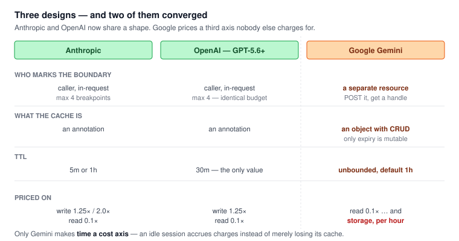
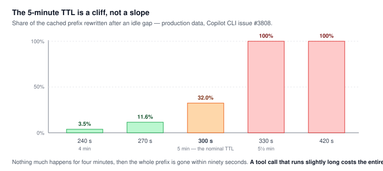
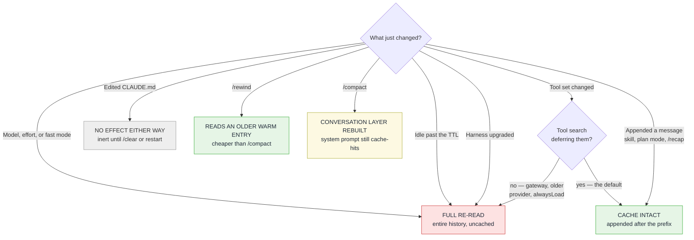

# 02 — Prompt caching

**Research date:** 2026-09-10. **Scope:** the caching mechanism both harnesses sit on, how each one
engineers its prefix around it, what invalidates a cache in each, and how to observe hit rate.

This is the track that drives most of the cost difference in track 06. Everything here reduces to one
invariant, stated once and then applied repeatedly.

---

## 0. TL;DR

1. **Prompt caching is a prefix match on exact bytes.** A change at position *N* invalidates everything
   at position ≥ *N*. There is no per-file, per-segment, or semantic caching.
2. Cache reads cost roughly **10% of input rate** on both vendors' pricing. Cache *writes* cost more
   than uncached input — 1.25× at 5-minute TTL, 2× at 1-hour.
3. Break-even is **one reuse** at 5m TTL, **two** at 1h. The longer TTL is not free.
4. Claude Code publishes an exhaustive invalidation catalogue and gives you TTL controls. Copilot
   publishes neither and gives you none.
5. **Retracted:** we called OpenAI's 24-hour retention a lever Claude Code could not match. It rests on
   one blog sentence (§3.2), and OpenAI's current explicit mode caps TTL at `30m` (§2).
6. Claude Code's cache is scoped **per machine and per directory** — narrower than most users assume.

---

## 1. The mechanism

The API caches by matching the **start** of each request — the prefix — against content it recently
processed. Per
[Anthropic's prompt caching docs, fetched 2026-09-10](https://platform.claude.com/docs/en/build-with-claude/prompt-caching),
the match is exact, and render order is `tools` → `system` → `messages`.

Claude Code's own documentation states the consequence bluntly: "The match is exact, so a change
anywhere in the prefix recomputes everything after it. There is no per-file or per-segment caching."
([Claude Code prompt caching, fetched 2026-09-10](https://code.claude.com/docs/en/prompt-caching))

This single property explains essentially every design decision in both harnesses.

### 1.1 Pricing

| Token class | Anthropic API rate | Copilot AI-credit rate |
|---|---|---|
| Cache read | ~0.1× input | 10% of input rate |
| Cache write, 5m TTL | 1.25× input | +25% on input (Anthropic + GPT-5.6/6 models) |
| Cache write, 1h TTL | 2.0× input | not exposed as a separate lever |
| Uncached input | 1.0× | 1.0× |

Copilot rates from
[Models and pricing for GitHub Copilot, fetched 2026-09-10](https://docs.github.com/en/copilot/reference/copilot-billing/models-and-pricing);
older OpenAI models there carry **no cache write cost** at all.

**Break-even.** At 5m TTL, two requests over the same prefix cost `1.25 + 0.1 = 1.35×` versus `2×`
uncached — ahead after a single reuse. At 1h TTL the write is `2×`, so `2.0 + 0.2 = 2.2×` versus `3×`
— you need two reads. A 1-hour TTL on short bursts that never idle past five minutes is a straight
loss: you pay the higher write rate and never use the longer lifetime.

### 1.2 Minimum cacheable prefix — and it is not monotonic

Below the model's minimum, a `cache_control` marker silently does nothing. No error;
`cache_creation_input_tokens` simply comes back `0`.

| Model | Minimum |
|---|---|
| Claude Opus 5, Fable 5, Mythos 5 | 512 tokens |
| Opus 4.8, Sonnet 5, Sonnet 4.6, Sonnet 4.5, Opus 4.1 | 1024 tokens |
| Opus 4.7, Mythos Preview, Haiku 3.5 | 2048 tokens |
| Opus 4.6, Opus 4.5, Haiku 4.5 | 4096 tokens |

Source: [Anthropic prompt caching, fetched 2026-09-10](https://platform.claude.com/docs/en/build-with-claude/prompt-caching).
Note the shape: **newer is not always lower**. A 3k-token prefix caches on Opus 5 and silently does not
on Haiku 4.5. Anyone routing a cheap sub-task to Haiku to save money may be paying full input rate on
every turn without any signal that it is happening.

## 2. Breakpoints

**Anthropic — explicit, budget of 4.** The caller places `cache_control` markers. Claude Code places
them for you. Copilot's placement is documented in a release note, verbatim
([VS Code 1.118, 2026-04-29](https://code.visualstudio.com/updates/v1_118)):

> **Strategic cache breakpoint placement.** We audited where cache breakpoints are set so they are used
> efficiently and placed at stable boundaries: **end of system prompt, end of tools, end of the most
> recent tool turn, and conversation turn boundaries.** As a result, once an agent session is underway,
> more than 93% of each request is reused from cache instead of being charged as new input.

An earlier edition of this document described Copilot's placement as "two rolling anchors on recent
messages." That is a real strategy but it is **an opt-in setting**, not the default:
`github.copilot.chat.anthropic.cacheBreakpoints.lastTwoMessages`. Corrected here.

The same release note describes a complementary trick worth stealing — deliberately making the tools
array byte-stable: `chat.experimental.symbolTools.cacheStable` gives two tools static descriptions, and
"we also re-ordered the tools list so deferred and non-deferred tools are grouped predictably, keeping
the tools-array bytes identical across turns."

**OpenAI — automatic, and since GPT-5.6, also explicit.**

> [!IMPORTANT]
> **Correction.** Earlier editions of this document described OpenAI's caching as automatic-only and
> built the Copilot analysis on "two incompatible paradigms." That was true through GPT-5.5 and is
> **no longer true.** As of **2026-07-09**, GPT-5.6 supports explicit caching:
> `prompt_cache_options: {mode: "explicit"}` with `prompt_cache_breakpoint` markers, **max 4 cache
> writes per request, writes billed at 1.25× input and reads at 0.1×**
> ([OpenAI prompt caching guide, fetched 2026-09-10](https://developers.openai.com/api/docs/guides/prompt-caching)).
>
> Those are **the same numbers and the same breakpoint budget as Anthropic.** The two paradigms
> converged rather than staying incompatible, which weakens the "Copilot solved a harder abstraction
> problem" framing considerably — that framing was accurate for the period Copilot's architecture was
> built in, and is now partly historical.

| Mode | Availability | Breakpoints | Write | Read |
|---|---|---|---|---|
| Implicit | pre-5.6 and 5.6+ | inferred; rounds down to a multiple of 128 | **free** pre-5.6 | 0.1× |
| **Explicit** | **GPT-5.6+** | caller-placed, **max 4** | **1.25×** | 0.1× |

<picture>
  <source media="(prefers-color-scheme: dark)" srcset="../assets/caching-paradigms-dark.svg">
  
</picture>

Minimum cacheable prefix is 1,024 tokens on both modes. TTL on 5.6+ is `30m` — **the only supported
value**, and the default. Pre-5.6 implicit caching used `prompt_cache_retention` with `in_memory`
(5–10 min, up to 1 hour) or `24h`, which is where this repo's grade-D 24-hour claim originates.

The docs also state the invalidation rule in terms this repo has been arguing independently:
*"Summarization, compaction, or context truncation can change the prefix and reset cache reuse."*
Their recommended mitigation is the same one Manus derived from first principles — **mask tools rather
than removing them**, via `tool_choice: "none"` or `allowed_tools`, so the tool list stays byte-stable.

**The lookback window.** Each breakpoint walks backward a bounded number of content blocks to find a
prior entry. A turn that emits many tool-call blocks can push the previous entry outside that window,
producing a silent miss on an otherwise-unchanged prefix. Copilot's two rolling anchors are a direct
mitigation. This is the least-known cache failure mode in agentic loops, and it gets worse the more
parallel tool calls a turn makes.

## 3. TTL

Cached prefixes expire after **inactivity**, and every cache hit resets the timer — so an actively-used
session stays warm indefinitely. The cost lands on the first turn back after a break.

| | Claude Code | Copilot |
|---|---|---|
| Default TTL | 1h on a Claude subscription within plan usage; **5m** on API key, cloud provider, or once on usage credits | Provider default (OpenAI 5–10 min); **5m on the Anthropic path, never configurable** |
| User control | `promptCacheTtl` / `subagentPromptCacheTtl` (`5m` or `1h`), env vars, `FORCE_PROMPT_CACHING_5M` | **No TTL setting.** One undocumented keep-alive workaround — §3.3 |
| Longest available | 1 hour | 1h on OpenAI in principle; 24h claimed in a blog post but **unevidenced** — §3.2 |

### 3.1 Claude Code's two buckets

Claude Code splits every request into one of two TTL buckets:

- **Main conversation** — interactive turns, `-p` runs, Agent SDK turns, and inline helpers.
- **Everything else** — subagents, workflows, teammates, forks, compaction, session titles.

Precedence, first match wins
([Claude Code prompt caching, fetched 2026-09-10](https://code.claude.com/docs/en/prompt-caching)):

```text
1. FORCE_PROMPT_CACHING_5M=1                      # both buckets, debugging override
2. CLAUDE_CODE_{,SUBAGENT_}PROMPT_CACHE_TTL       # env, per bucket
3. promptCacheTtl / subagentPromptCacheTtl        # settings.json, per bucket
4. subagent frontmatter experimental.cacheTtl
5. ENABLE_PROMPT_CACHING_1H=1                     # both buckets
6. bucket default
```

The asymmetry matters: **subagents get 5 minutes even on a subscription** unless you set the second
bucket explicitly. A fan-out of subagents that idles briefly is re-reading cold.

**Version floor — and the docs are off by one.** Anthropic's documentation says these settings require
**v2.1.242**. The changelog says otherwise: they shipped in **v2.1.243**, and **there is no v2.1.242
section in the changelog at all** — the file goes 2.1.241 → 2.1.243.

> `Added promptCacheTtl and subagentPromptCacheTtl settings so API-key and cloud-provider users can
> keep a 1-hour prompt cache on the main conversation while subagents stay at 5 minutes`
> — [CHANGELOG v2.1.243, fetched 2026-09-10](https://github.com/anthropics/claude-code/blob/9cdc2a4d946c586a8472e504fb20b3e79106518c/CHANGELOG.md?plain=1#L656)

We separately confirmed they are absent from the v2.1.220 binary — not merely undocumented there, but
non-existent. Anyone following advice to "just set `promptCacheTtl`" on an older build will find
nothing happens, with no error.

The two environment variables are a weaker case: **neither `CLAUDE_CODE_PROMPT_CACHE_TTL` nor
`CLAUDE_CODE_SUBAGENT_PROMPT_CACHE_TTL` appears anywhere in the changelog.** They are documented but
were never announced, so we cite the docs page for their existence and the changelog only for the
settings. See [`../GAPS.md`](../GAPS.md) §2.

The older global flags have clean evidence — both landed together in **v2.1.108**:

> `Added ENABLE_PROMPT_CACHING_1H env var to opt into 1-hour prompt cache TTL on API key, Bedrock,
> Vertex, and Foundry (ENABLE_PROMPT_CACHING_1H_BEDROCK is deprecated but still honored), and
> FORCE_PROMPT_CACHING_5M to force 5-minute TTL`
> — [CHANGELOG v2.1.108, fetched 2026-09-10](https://github.com/anthropics/claude-code/blob/9cdc2a4d946c586a8472e504fb20b3e79106518c/CHANGELOG.md?plain=1#L3472)

The per-agent override in the precedence table shipped in **v2.1.248**
([changelog](https://github.com/anthropics/claude-code/blob/9cdc2a4d946c586a8472e504fb20b3e79106518c/CHANGELOG.md?plain=1#L499)).

### 3.2 Copilot's 24-hour retention — a claim we had to downgrade

An earlier edition of this document called `prompt_cache_retention: "24h"` "the single largest cache
lever either product has shipped." **That was overstated and is corrected here.**

The OpenAI *parameter* is real and documented by OpenAI. The claim that **Copilot sets it** rests on a
single sentence in one vendor blog post
([VS Code, 2026-06-17](https://code.visualstudio.com/blogs/2026/06/17/improving-token-efficiency-in-github-copilot)),
with **no corresponding release note, PR, or changelog entry**. A grep across VS Code release notes
v1.107–v1.138 for `prompt_cache_retention` or `24h` returns zero hits; the `copilot-cli` changelog has
none either. The accompanying hit-rate figures — +919% on GPT-5.4, +338% on GPT-5.2, +279% on
GPT-5.3-Codex after 40–60 minutes idle — come from that same post and have never been reproduced.

Graded **D — vendor blog only** in [`../TIMELINE.md`](../TIMELINE.md) §3. It may well be shipped and
simply unannounced; we cannot show that it is. Treat any comparison that leans on it as resting on one
sentence.

What survives the downgrade: Anthropic's ceiling **is** one hour, and OpenAI's parameter **does** allow
24. So the *architectural* asymmetry is real. The claim that Copilot has operationalised it is not
evidenced.

### 3.3 The 5-minute cliff, and the fix almost nobody knows about

[microsoft/vscode#321551](https://github.com/microsoft/vscode/issues/321551) — filed 2026-06-16, **still
open** as of 2026-09-10, milestone `Backlog Candidates`, no assignee, no linked PR — reports the cache
silently expiring mid-session when consecutive model calls are more than ~5 minutes apart: a long
terminal command, a large file read, or waiting on the user.

The reporter's cost figures (3–5× on the affected turn, 8–15× cumulative) are **one user's estimate**,
unreproduced, graded E. But the *mechanism* is now independently quantified. On
[copilot-cli#3808](https://github.com/github/copilot-cli/issues/3808), 2026-08-10, production session
data binned by idle gap:

<picture>
  <source media="(prefers-color-scheme: dark)" srcset="../assets/ttl-decay-cliff-dark.svg">
  
</picture>

| Idle gap | Prefix rewritten |
|---|---|
| 240 s | 3.5% |
| 270 s | 11.6% |
| **300 s** | **32.0%** |
| **330 s** | **100%** |

**That is the TTL cliff with numbers on it.** Nothing much happens before four minutes; a third of the
prefix is gone at five; it is total by five and a half. This is the best-quantified cache-decay data
either vendor has published, and it is buried in an issue comment.

**We were also wrong that Copilot offers no workaround.** It does — it is just undocumented and off by
default. [PR #316277](https://github.com/microsoft/vscode/pull/316277), merged 2026-05-30 and shipped
in **VS Code 1.123**, adds `github.copilot.chat.agent.longToolCallCachePreservation`: keep-alive probes
sent every ~4 minutes during long tool calls to hold the server-side cache warm. From the PR body:

> "my PR resulted in more requests and more cached input tokens, but lower costs overall thanks to far
> fewer uncached tokens" — benchmark **$29.26 with the fix vs $39.61 without**

It shipped **experimental, default-off, and with no release-note coverage at all** (grepped
v1.107–v1.138 for `preservation|keepalive|longToolCall`: no hits). The reporter of #321551 discovered it
by accident two months later. Graded **B — code evidence, no release note**.

The honest comparison, then: Claude Code answers this with a documented 1-hour TTL; Copilot answers it
with an undocumented default-off probe loop. Both are answers. Only one is findable.

**And Copilot has never shipped a 1-hour TTL on its Anthropic path.** From the same #3808 comment:
`CacheControlCheckpoint = { type: "ephemeral" }` carries **no lifetime field**, and production data
shows "exactly one cache-write price, always 1.25× base, and the 2× rate never appears."

## 4. What invalidates the cache



> [!TIP]
> The two paths people get wrong: **`/rewind` is cheaper than `/compact`** when abandoning a line of
> work, and **editing `CLAUDE.md` mid-session does nothing at all** — which is exactly why it is
> cache-safe.

### 4.1 Claude Code — documented exhaustively

Anthropic publishes a full catalogue. Condensed
([fetched 2026-09-10](https://code.claude.com/docs/en/prompt-caching)):

| Action | Effect | Notes |
|---|---|---|
| Switching models | Full re-read | Each model has its own cache. Confirms before switching while warm |
| Changing effort level | Full re-read | Exception: Fable 5.1 on API key/subscription keeps cache (v2.1.260+) |
| Enabling fast mode | Full re-read, once per conversation | Header is part of the cache key; billed at fast-mode rates |
| MCP server connect/disconnect | Full re-read **only if** tools load into the prefix | Free when tool search defers them — see track 04 |
| Plugin enable/disable | Depends on components | Skills/commands/agents/hooks append and are free; MCP-providing plugins follow the MCP rule |
| Bare tool deny rule (`Bash`, `*`) | Full re-read | Removes the definition from the prefix. Scoped rules like `Bash(rm *)` do not |
| Output style switch | Free on subscription; full re-read on Bedrock/GCP/Foundry | Depends on whether the style ships as a message or in the system prompt |
| `/compact` | Conversation layer by design | System prompt preserved; project context re-read from disk |
| Image accumulation | Partial re-read | Oldest images evicted in batches when limits are hit |
| Upgrading Claude Code | Full re-read | **Resuming a long session after an upgrade is the most expensive request in the product** |

Cache-**safe** actions worth knowing: editing repo files, editing `CLAUDE.md` mid-session (it also
does not take effect until `/clear` or restart), permission-mode changes, invoking skills and commands,
`/recap`, spawning a subagent, and — the useful one — **`/rewind`**, which truncates back to a prefix
that is already warm. When abandoning a line of work, rewinding is strictly cheaper than compacting.

### 4.2 Copilot — inferred, not published

GitHub does not publish an equivalent catalogue. What can be established from its own posts:

- **Model switching invalidates**, which is why routing is constrained to cache boundaries
  ([track 03 §3](03-context-management.md)).
- **Compaction resets the prefix** — explicitly described as a boundary where re-routing is safe.
- **Deferred tools do not invalidate**, because they are appended rather than placed in the prefix.

Everything else is unknown from outside. This is a genuine asymmetry in what a user can reason about,
independent of which product caches better.

## 5. Prefix engineering as architecture

Anthropic's [engineering post, fetched 2026-09-10](https://claude.com/blog/lessons-from-building-claude-code-prompt-caching-is-everything)
documents three decisions made *for* the cache:

- **Plan mode is a tool, not a mode.** Swapping the tool set would rewrite position 0. Instead the
  model is instructed to use read-only tools and calls `ExitPlanMode` itself. The prefix never moves.
- **Deferred tool loading.** Tool stubs stay "in the same order"; full schemas load only when selected.
- **Compaction reuses the parent prefix.** The summarisation call sends the same system prompt, tools,
  and history plus one appended instruction — so a warm `/compact` reads almost everything from cache
  and spends its time generating, not reprocessing.

Copilot's equivalents, from the VS Code post: tool search with client-side embedding-guided selection
over a curated core toolset (**11–18% fewer prompt and total tokens per session** on Anthropic models,
8.6–9.8% on OpenAI), and compaction as a deliberate re-routing boundary.

Reported cache hit rate on Copilot's Anthropic path: **">93% of each request is reused from cache"**
([VS Code 1.118 release note](https://code.visualstudio.com/updates/v1_118)). The June blog rounds this
to ~94%; prefer the release note, which is the primary artifact. There is no published Claude Code
equivalent — Anthropic states it alerts on the metric but does not publish the number, so **no
vendor-to-vendor hit-rate comparison is available in either direction.**

### 5.1 The changelog is the best evidence that this is hard

Reading the Claude Code changelog end to end (390 versions, through v2.1.267) turns up roughly **70
entries that touch prompt caching** — and the large majority are not features. They are **fixes for
cache-invalidation regressions**, shipped continuously across the entire 2.1 line.

That pattern is the strongest available evidence for this repo's central claim: prefix stability is
not a thing you design once. It is a property that decays, in a product whose vendor treats hit rate as
a production SLO. A sample, each verbatim
([CHANGELOG, fetched 2026-09-10](https://github.com/anthropics/claude-code/blob/9cdc2a4d946c586a8472e504fb20b3e79106518c/CHANGELOG.md)):

| Version | Entry | What it tells you |
|---|---|---|
| 2.1.42 | `Improved prompt cache hit rates by moving date out of system prompt` | The textbook invalidator — a timestamp in the prefix — shipped in production |
| 2.1.30 | `Fixed prompt cache not correctly invalidating when tool descriptions or input schemas changed, only when tool names changed` | Cache keys can be *too loose* as well as too tight |
| 2.1.72 | `Fixed prompt cache invalidation in SDK query() calls, reducing input token costs up to 12x` | A single invalidation bug was a **12×** cost multiplier |
| 2.1.89 | `Fixed prompt cache misses in long sessions caused by tool schema bytes changing mid-session` | Byte-level instability, invisible to the user |
| 2.1.181 | `Fixed prompt caching not reading on custom ANTHROPIC_BASE_URL and on Foundry due to a per-request attestation token changing every turn` | The gateway trap in §6.1, confirmed as a real shipped defect |
| 2.1.235 | `Fixed whole-prompt-cache invalidation when a language server disconnected or reconnected mid-session` | An LSP restart silently cost a full re-read |
| 2.1.248 | `Fixed a prompt-cache miss … roughly once an hour in long sessions, caused by tool definitions being re-rendered after an OAuth token refresh` | An auth refresh — nothing to do with content — broke the prefix hourly |
| 2.1.267 | `Fixed switching models with /model re-sending every tool definition (a prompt-cache miss)` | Still being fixed in the current release |

Two conclusions follow. First, **the invalidation catalogue in §4.1 is a snapshot of a moving target** —
several entries in it describe behaviour that was itself a bug at some point. Second, if a vendor with
this much invested in caching ships this many prefix regressions, the correct posture for a user is to
**measure your own hit rate rather than reason about it from documentation**. That is the argument for
the harness in [`../measure/`](../measure/).

## 6. Cache scope

**Claude Code** is effectively scoped to **one machine and one directory**, because the system prompt
embeds working directory, platform, shell, OS version, and memory paths. Worktrees of the same repo do
not share. Sequential sessions in one directory share only if the git status snapshot matches. Parallel
sessions in the same directory do share
([fetched 2026-09-10](https://code.claude.com/docs/en/prompt-caching)).

The underlying API cache is broader — isolated between organizations, and on some providers between
workspaces, but shared by any two requests with the same model and prefix inside those bounds.

**Copilot's** cache scope is not documented.

### 6.1 The gateway trap

If requests pass through an LLM gateway or a custom `ANTHROPIC_BASE_URL`, three outcomes:

1. Gateway **forwards `cache_control` unchanged** → caches normally.
2. Gateway **rejects with a 400 naming `cache_control`** → Claude Code moves the marker and continues.
3. Gateway **strips the markers and returns 200** → the entire conversation bills as uncached input on
   every turn, **with no error**.

Case 3 is the expensive one precisely because it is silent. A gateway that converts block-form system
content to a plain string drops the marker the same way. If you front either harness with a proxy,
verify `cache_read_input_tokens` is non-zero before trusting the setup.

## 7. Observing it

| Surface | Claude Code | Shipped in | Copilot |
|---|---|---|---|
| Per-turn counters | `cache_read_input_tokens`, `cache_creation_input_tokens` | — | via OTel span attributes only |
| In-product view | per-session prompt-cache line: hit ratio, misses, tokens re-cached, warm/cold | [v2.1.251](https://github.com/anthropics/claude-code/blob/9cdc2a4d946c586a8472e504fb20b3e79106518c/CHANGELOG.md?plain=1#L423) | none |
| Miss cause attribution | `likely cause: …` (tool definitions or system prompt changed, idle past TTL) | [v2.1.260](https://github.com/anthropics/claude-code/blob/9cdc2a4d946c586a8472e504fb20b3e79106518c/CHANGELOG.md?plain=1#L193) | none |
| Live per-turn | statusline `prompt_cache` object | v2.1.251 (same entry) | none |
| Programmatic | `claude -p … --output-format json` → `usage.cache_creation.{ephemeral_5m,ephemeral_1h}_input_tokens` | — | OTLP collector required |

**A naming discrepancy worth knowing.** Anthropic's docs describe this panel under `/usage`; the
changelog entry that shipped it says `/cost`. Both are correct — `/cost` and `/stats` were merged into
`/usage` as tabs in **v2.1.118**, with the old names retained as shortcuts that open the relevant tab.
If you are searching the changelog for this feature, search `/cost`.

**Field shape, verified 2026-09-10:** `usage.cache_creation` is an object with
`ephemeral_5m_input_tokens` and `ephemeral_1h_input_tokens`, and these are **nullable**;
`cache_creation_input_tokens` is derived as their sum and may be absent. Any script parsing this must
handle null rather than assuming a number — ours does, in
[`../measure/lib/emit.sh`](../measure/lib/emit.sh).

This repo's measurements of real hit rate under controlled conditions live in
[`../measurements/`](../measurements/); the protocol is in [`../METHODOLOGY.md`](../METHODOLOGY.md).

## 8. What we could not determine

Recorded in full in [`../GAPS.md`](../GAPS.md); the caching-specific items:

- Anthropic's server-side cache internals — real eviction policy, exact TTL clock, cross-session
  sharing behaviour within an org.
- Copilot's system prompt and tool-definition byte counts. Closed, and its spans carry no content.
- Copilot's full invalidation catalogue.
- Whether the 3–5× / 8–15× figures in vscode#321551 reproduce.

## Sources

- [Anthropic prompt caching, fetched 2026-09-10](https://platform.claude.com/docs/en/build-with-claude/prompt-caching)
- [How Claude Code uses prompt caching, fetched 2026-09-10](https://code.claude.com/docs/en/prompt-caching)
- [Anthropic: Prompt caching is everything, fetched 2026-09-10](https://claude.com/blog/lessons-from-building-claude-code-prompt-caching-is-everything)
- [VS Code: Improving token efficiency in GitHub Copilot, fetched 2026-09-10](https://code.visualstudio.com/blogs/2026/06/17/improving-token-efficiency-in-github-copilot)
- [Models and pricing for GitHub Copilot, fetched 2026-09-10](https://docs.github.com/en/copilot/reference/copilot-billing/models-and-pricing)
- [microsoft/vscode#321551 — cache expires mid-session, fetched 2026-09-10](https://github.com/microsoft/vscode/issues/321551)
- [GitHub: Getting more from each token, fetched 2026-09-10](https://github.blog/ai-and-ml/github-copilot/getting-more-from-each-token-how-copilot-improves-context-handling-and-model-routing/)

---

← [01 — Request lifecycle](01-request-lifecycle.md) · [Index](../README.md) · [03 — Context management](03-context-management.md) →
