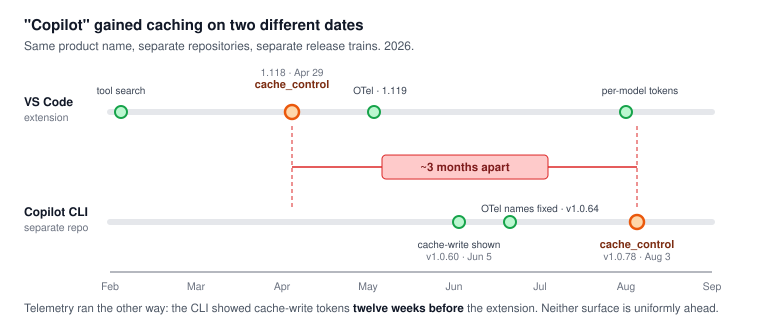

# "Copilot" is not one product

The single most common error in Copilot cost analysis — including two made by earlier editions of this
repo — is treating **GitHub Copilot** as one thing. It is at least three separate implementations, in
three separate repositories, that ship on different schedules and gained caching **months apart**.

> [!CAUTION]
> A benchmark, a bug report, or a cost figure about one surface **does not transfer to another**. The
> CLI got `cache_control` breakpoints roughly **three months after** the VS Code extension did. Any
> claim of the form "Copilot does X" needs to name the surface or it is unfalsifiable.

---

## The three surfaces

| | VS Code extension | Copilot CLI | Copilot SDK |
|---|---|---|---|
| Repository | [`microsoft/vscode`](https://github.com/microsoft/vscode) | [`github/copilot-cli`](https://github.com/github/copilot-cli) | [`github/copilot-sdk`](https://github.com/github/copilot-sdk) |
| Ships with | VS Code releases — **weekly since March 2026** | Its own semver (`v1.0.x`) | Its own semver (`v0.x`) |
| Versioned as | `1.109`, `1.118`, `1.137`… | `v1.0.51`, `v1.0.78`… | `v0.2.2`, `v0.3.0`… |
| Changelog | [VS Code release notes](https://code.visualstudio.com/updates) | [`changelog.md`](https://github.com/github/copilot-cli/blob/main/changelog.md), 3,083 lines | GitHub releases |

There is a **fourth** component with no public repository at all: the **Copilot CLI server**. Its
existence is documented only as the root cause on
[`copilot-sdk#1073`](https://github.com/github/copilot-sdk/issues/1073) — the SDK's own bot concluded
*"The fix needs to happen in the Copilot CLI server (separate repository). The SDK schema and types are
already correct."* That component is closed source, so fixes landing in it are **not publicly
auditable**.

## Caching arrived on different dates

This is the table that matters. Same product name, three months apart.

<picture>
  <source media="(prefers-color-scheme: dark)" srcset="../assets/copilot-surfaces-timeline-dark.svg">
  
</picture>

| Capability | VS Code extension | Copilot CLI |
|---|---|---|
| `cache_control` breakpoints on Claude | **1.118** — 2026-04-29 | **v1.0.78** — 2026-08-03 |
| Documented breakpoint placement | ✅ release note, verbatim | ❌ **zero** hits for `cache_control`, `breakpoint`, or `ttl` in 3,083 changelog lines |
| Published cache-reuse figure | ✅ ">93% of each request" | ❌ none |
| Tool search / deferred loading | **1.109** (Anthropic) · **1.118** (OpenAI) | not separately announced |
| Cache keep-alive workaround | **1.123** — `longToolCallCachePreservation` | ❌ none |
| Cache-aware Auto routing | changelog 2026-05-20 | changelog **2026-07-01** — six weeks later |

**Evidence quality differs as much as the dates.** The extension's caching behaviour is documented in a
release note you can quote. The CLI's exists in the public record **only as a closing comment** on
[`copilot-cli#4256`](https://github.com/github/copilot-cli/issues/4256) — and that comment turns out to
be **bot-authored** under a staff account, so it is graded **D** in
[`../TIMELINE.md`](../TIMELINE.md).

## Telemetry arrived in the other order

The direction reverses, which is why "the extension is ahead" is also wrong:

| Capability | VS Code extension | Copilot CLI |
|---|---|---|
| OTel emission | **1.119** — 2026-05-06 | inherits the GenAI conventions |
| Correct `gen_ai.usage.cache_read.*` names | 1.119 | **v1.0.64** — 2026-06-23, explicitly fixing *"incorrect underscore-separated names"* |
| Cache **write** tokens in `/usage` | 1.135 — 2026-08-26 | **v1.0.60** — 2026-06-05, **twelve weeks earlier** |
| Per-model token totals | 1.135 — 2026-08-26 | **v1.0.64** — 2026-06-23 |
| Hooks emit correlated trace context | — | v1.0.81 — 2026-08-27 |

> [!IMPORTANT]
> **The CLI led the extension on cost visibility by about two months**, while trailing it by three on
> caching itself. Neither surface is uniformly ahead. Any "Copilot's telemetry is X" claim has to say
> which one, and as of when.

## It is worse than three surfaces — the CLI diverges from itself

[`copilot-cli#4720`](https://github.com/github/copilot-cli/issues/4720) (open, filed 2026-09-04) is the
sharpest structural evidence available, because it controls for everything: **same binary, same machine,
same model, 150 requests.**

| Mode, on v1.0.82 | Cache hit rate | Session cost |
|---|---|---|
| BYOK | **0%** | **$61.21** |
| GitHub subscription | works | — |
| BYOK, on v1.0.80 | 97.7% | **$28.92** |

> [!CAUTION]
> **The BYOK and subscription request builders are different code paths with different cache behaviour
> inside a single binary.** A "Copilot CLI v1.0.82" cost figure is *still* not a claim — you have to say
> which auth mode. Roughly **$49 of avoidable spend in one session** turned on that distinction.

Two more intra-CLI divergences worth knowing:

- **Billing classification is inconsistent within the CLI itself.**
  [`cli#2068`](https://github.com/github/copilot-cli/issues/2068) (open since 2026-03-16, **never
  triaged**): compaction consumes a premium request but session naming — *also* a background operation —
  does not. The reporter states the extension marks such requests agent-initiated via a caller-controlled
  boolean and is not charged.
- **Tool deferral is server-gated per model.**
  [`cli#4588`](https://github.com/github/copilot-cli/issues/4588): a server-managed flag only returns
  true for Claude, so `"hi"` costs **21.6k** tokens on sonnet-4.6, **47.6k** on gpt-5.4, and **61.9k** on
  grok-4.6. **The client cannot influence this**, and no changelog records it.

> [!NOTE]
> **A caveat against over-claiming.** A VS Code stack trace on
> [`cli#2496`](https://github.com/github/copilot-cli/issues/2496) resolves to
> `github.copilot-chat-0.42.3/node_modules/@github/copilot/sdk/index.js` — **the extension bundles the
> same `@github/copilot` SDK as the CLI.** So the accurate claim is not "separate implementations" but:
> *they share the SDK core and diverge in the request-classification and billing-annotation layer above
> it* — with `#4720` proving those layers already diverge inside one binary.

## The dating trap

There is a **data-quality window** that invalidates historical analysis:

- Before **2026-05-20** (CLI v1.0.51, *"Ensure input token usage includes cached"*), cache token
  reporting is unreliable — `copilot-sdk#1073` had both fields hardcoded to `0.0`.
- Before **2026-06-23** (CLI v1.0.64), the OTel attribute **names themselves were non-conforming**.

Any Copilot cost analysis spanning that window measured a broken instrument. If you have historical
telemetry, check its dates before trusting its cache columns.

## How this repo handles it

| Where | Which surface | Why |
|---|---|---|
| [Track 02](../docs/02-prompt-caching.md) breakpoint placement | **VS Code extension** | Only surface with a documented placement strategy |
| [Track 04](../docs/04-tool-and-mcp-loading.md) tool search | **VS Code extension** | Release notes name the settings and the core-set sizing |
| [Track 05](../docs/05-telemetry.md) OTel field names | **VS Code extension**, with CLI dates noted | The docs page describing the schema is VS Code's |
| [Track 02 §3.3](../docs/02-prompt-caching.md) TTL decay data | **Copilot CLI** | The idle-gap measurements come from `copilot-cli#3808` |
| Everything | **not the SDK** | The SDK is a client library, not a harness |

And a limitation restated: **no Copilot seat was available**, so none of the above was observed on any
surface. See [`../GAPS.md`](../GAPS.md) §3.

## What this means if you are comparing

1. **Name the surface and the version.** "Copilot CLI v1.0.78" is a claim. "Copilot" is not.
2. **Do not port a CLI benchmark to the extension**, or vice versa. Three months of caching divergence
   is enough to invert a cost comparison.
3. **Check your telemetry's date** against the 2026-05-20 / 2026-06-23 boundaries above.
4. **Claude Code has the same trap in miniature** — the terminal CLI, the VS Code extension, the
   desktop app, and the Agent SDK are one implementation but not one configuration. `--bare` alone
   changes auth, memory, hooks, and therefore what a cost figure means
   ([track 06 §5](../docs/06-billing-cost-anatomy.md)).

---

[Index](../README.md) · [Settings](SETTINGS.md) · [Known issues](KNOWN-ISSUES.md) · [Timeline](../TIMELINE.md)
